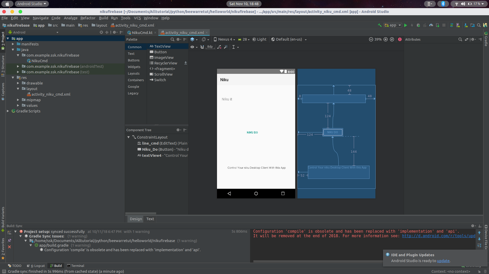

# NIKU ANDROID APP

This app is based on [niku 1.0](https://github.com/sanjaykhanssk/niku-1.0)

you can send data or command from your app to niku desktop client  

>it uses google firebase to send the data from App to Desktop 

if your device has google voice just read and click send
